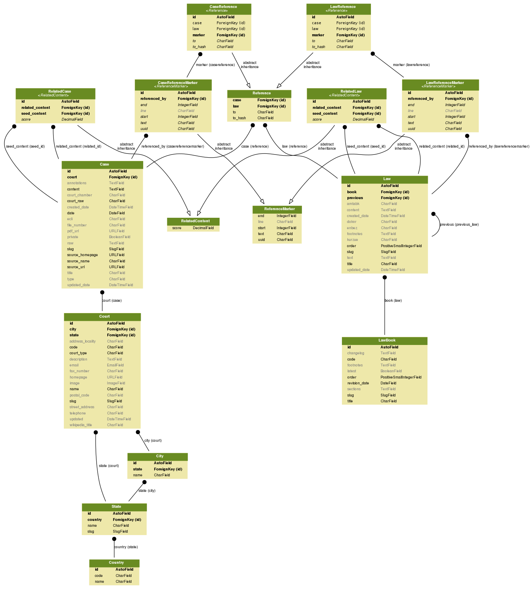

# Architecture overview

OLDP is a [Django](https://www.djangoproject.com/) project organised into a set
of focused apps under `oldp/apps/`. This page gives a high-level map of those
components, the core data model, and how a request or a piece of content flows
through the system. For setup see [Getting Started](getting-started.md); for the
surrounding projects see [The OLDP ecosystem](ecosystem.md).

## Applications

Each Django app under `oldp/apps/` owns one part of the domain:

| App | Responsibility |
| --- | -------------- |
| `cases` | Court decisions (`Case`, `RelatedCase`): metadata, HTML content, file number, ECLI, review status. |
| `laws` | Legislation: `LawBook` (a collection with revisions) and `Law` (a section), plus `RelatedLaw`. |
| `courts` | Court entities and their geography: `Court`, `State`, `City`, `Country`. |
| `references` | Citation extraction and linking between content items (`Reference`, reference markers). |
| `search` | Full-text search via Haystack + Elasticsearch; `SearchableContent` mixin, `SearchQuery`. |
| `annotations` | User annotations on content: `AnnotationLabel`, `CaseAnnotation`, `CaseMarker`. |
| `sources` | Provenance of imported content: `Source` and the `SourceContent` mixin. |
| `accounts` | User accounts, API tokens and granular per-token permissions (extends django-allauth). |
| `processing` | The content-processing pipeline (`ContentProcessor`, input handlers, timeouts). |
| `mcp` | Model Context Protocol server exposing OLDP to AI agents. |
| `lib` | Shared utilities, notably `markers.py` (reference-marker insertion with drift recovery). |
| `topics` | Topic / category taxonomy. |
| `homepage` | Landing page and static page rendering. |
| `contact` | Contact / feedback form. |

## Data model

The core entities and their relationships:

- **Case ↔ Court** — every `Case` belongs to a `Court`. Courts are organised
  hierarchically by `Country → State → City`, and classified by court type and
  level of appeal (the German court types are contributed by the
  [oldp-de](https://github.com/openlegaldata/oldp-de) theme).
- **Law ↔ LawBook** — a `LawBook` (e.g. *BGB*) groups many `Law` sections and
  is versioned by revision date, with a `latest` flag marking the current
  revision. Laws link to their previous/next section.
- **Reference** — extracted citations are stored as `Reference` rows. Law
  citations are keyed by a `(law_book_slug, law_section_slug)` pair rather than
  a numeric id, so they survive law-book revisions and database rebuilds.
- **Source** — imported content carries a `Source` (the crawler/provider it came
  from) via the `SourceContent` mixin; this is how
  [oldp-ingestor](ecosystem.md#oldp-ingestor-data-ingestion) provenance is
  tracked.
- **Annotations** — `AnnotationLabel` defines labels (colour, trust level, value
  type); `CaseAnnotation` and `CaseMarker` attach labelled, positioned markers
  to case text.

Several content models share cross-cutting mixins: `SearchableContent`
(indexable in Elasticsearch), `ReferenceContent` (has extractable citations),
`SourceContent` (has provenance), and `AnnotationContent` (can be annotated).

The relational schema is reflected in MySQL/SQLite — see [Database](database.md)
for the schema and encoding notes.

## Request flow

OLDP serves three surfaces from the same models:

1. **Web frontend** — server-rendered Django templates for `/case/`, `/law/`,
   `/court/`, `/search/` and static pages. The look and feel is supplied by a
   theme (see [Themes](#themes)).
2. **REST API** — built on [Django REST Framework](https://www.django-rest-framework.org/)
   with per-app viewsets and serializers, token authentication, and Swagger/ReDoc
   schema. See [REST API](api/api-overview.md).
3. **MCP server** — exposes discovery, search, retrieval and cross-reference
   tools to AI agents at `/mcp`. See [MCP Server](mcp.md).

Anonymous responses on public paths are made CDN-cacheable by
`AnonymousPublicCacheMiddleware` (configurable — see
[Configuration](configuration.md#anonymous-cdn-cache)).

## Processing pipeline

Raw imported content is refined by the processing pipeline in the `processing`
app. A `ContentProcessor` reads items from the database or filesystem and runs a
sequence of **processing steps** (e.g. resolve the court, extract references)
inside per-item transactions with timeout guards. Steps run from the Django
admin or via management commands (`process_cases`, `process_laws`,
`process_courts`, `process_references`). See [Processing](processing.md) and,
for writing your own step, [Development](development.md).

## Search and the citation graph

Search is powered by Elasticsearch through Haystack. Cases and laws are indexed
via `search_indexes.py` in their respective apps. Beyond full-text search, the
case index stores the **citation graph** — the `cited_laws` and `cited_cases`
fields — which powers the "referenced by" / "citing cases" panels and the REST
and MCP cross-reference endpoints. These fields are documented authoritatively
in [Elasticsearch → Index fields](elasticsearch.md); see also
[Searching](searching.md) for the user-facing filters.

## Themes

The frontend's templates and static assets can be overridden by a theme package
without touching the core. The reference theme is
[oldp-de](https://github.com/openlegaldata/oldp-de), which supplies the German
UI, German court types, and German-specific settings. A theme is activated by
pointing `DJANGO_SETTINGS_MODULE` at the theme's settings module (e.g.
`oldp_de.settings`). See [The OLDP ecosystem](ecosystem.md#oldp-de-german-theme).

## Configuration

All runtime behaviour is controlled through environment variables and
django-configurations classes. See the [Configuration reference](configuration.md)
for the complete list and [Deployment](deployment.md) for production setup.
