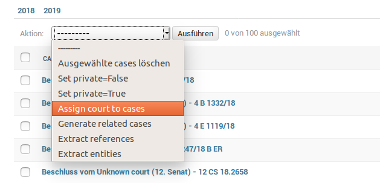

# Processing

OLDP comes with a data processing pipeline. How to write your own processing step is explained under [Development](development).
In the following we explain the execution of the processing pipeline.


## Django Admin

The most convenient way to execute processing steps is to use the Django admin interface.
For all models (e.g. cases or laws) that have available processing steps, you only need to select the target items
from the list by clicking on the checkboxes and then select one processing step from the action drop-down menu:



Be aware that processing can take time, especially when running complex steps on a large number of items.
Thus, the web server might time out and send you a 500 error message.

## Available content processors

For large data-sets and complex selection of to be processed items, it is recommened to execute the processing over commandline.
Each model comes with an own Django management command:

- Cases
  - Management command: `./manage.py process_cases`
- Laws
  - Management command: `./manage.py process_laws`
- Courts
  - Management command: `./manage.py process_courts`
- References
  - Management command: `./manage.py process_references`

### Parameters

Use the `--help` argument to display a list of available parameters.

```bash
  --input INPUT [INPUT ...]
  --input-handler INPUT_HANDLER
                        Read input from file system
  --order-by ORDER_BY   Order items when reading from DB
  --filter FILTER       Filter items when reading from DB
  --limit LIMIT
  --start START
  --max-lines MAX_LINES
  --source SOURCE       When reading from FS process files differently
                        (serializer)
  --empty               Empty existing index

```

When using `db` as input handler, the parameter `--filter` and `--exclude` are URL-encoded
and support [Django model queries](https://docs.djangoproject.com/en/2.1/topics/db/queries/) (See examples).


### Examples

Find corresponding court to all cases that are currently assign to the default court (default court id = 1):

```bash
./manage.py process_cases --input-handler db --filter court__pk=1 assign_court
```

Limit the number of processed cases to 100 and order by last updated date, i.e., process oldest first.

```bash
# Assign court
./manage.py process_cases --input-handler db --filter court__pk=1 --order-by updated_date --limit 100 assign_court

# Extract references
./manage.py process_cases --input-handler db --order-by updated_date --limit 100 extract_refs

```

Cases that are private and from courts located in state with id 5, exclude cases by type:

```bash
./manage.py process_cases --input-handler db --filter court__state_id=5&private=True --exclude type=Urteil all
```

Publish currently unpublished cases with a defined court:

```bash
./manage.py process_cases --input-handler db --order-by updated_date --filter court__pk__gt=1  --limit 100 set_private_false
```

This can be also done via the Django shell (`./manage.py shell`):
```python
from oldp.apps.cases.models import Case
Case.objects.filter(court__pk__gt=1, private=True).update(private=False)
```
